  

  

  
  &nbsp;
  
  &nbsp;
  
  &nbsp;
  
  &nbsp;
  

---

## `> cat profile.json`

  

---

## `> ls ./featured-work`

<table>
<tr>
<td width="50%" valign="top">

### 🤖 MIRA — AI Support Intelligence
> Multi-tenant enterprise support ops platform

- **RAG pipeline** with Qdrant vector search for smart ticket routing
- **LLM orchestration** (Groq/Gemini) — classification, sentiment, RCA
- Event-driven with **Kafka** + WebSockets + Redis caching
- **Salesforce** bidirectional sync + SLA breach prediction
- Multi-tenant RBAC, 7-day analytics forecasting

`NestJS` `PostgreSQL` `Qdrant` `Kafka` `Redis` `Next.js 14`

</td>
<td width="50%" valign="top">

### 💬 Zwing Chat — Enterprise Messaging
> Real-time communication layer for a production ERP

- **500+ concurrent users**, 10K+ daily messages, sub-second latency
- JWT SSO, RBAC, group + peer-to-peer messaging
- Horizontally scalable microservices + **MongoDB optimisation**
- Zero production incidents since launch

`NestJS` `Socket.io` `MongoDB` `JWT` `Docker`

</td>
</tr>
<tr>
<td width="50%" valign="top">

### 🏢 Adcon Realty CRM
> Full backend for real estate lifecycle management

- **50+ RESTful APIs** — deals, attendance, client lifecycle
- Firebase push notifications for real-time updates
- **40% improvement** in system reliability

`NestJS` `PostgreSQL` `MongoDB` `Firebase` `Docker`

</td>
<td width="50%" valign="top">

### 🎓 College Admin System
> Digital transformation for an academic institution

- Automated admissions & student records management
- **60% reduction** in manual paperwork
- Multi-role access — students, faculty, administration

`NestJS` `REST APIs` `PostgreSQL`

</td>
</tr>
</table>

---

## `> cat ./stack.json`

  

  
  
  
  

---

## `> git log --graph --oneline`

  

---

## `> metrics --all`

  

  
  &nbsp;
  

---

## `> watch ./snake-generator.sh`

  <picture>
    <source media="(prefers-color-scheme: dark)"  srcset="https://raw.githubusercontent.com/ayushanandchoudhary/ayushanandchoudhary/output/github-contribution-grid-snake-dark.svg"/>
    <source media="(prefers-color-scheme: light)" srcset="https://raw.githubusercontent.com/ayushanandchoudhary/ayushanandchoudhary/output/github-contribution-grid-snake.svg"/>
    
  </picture>

---

  

