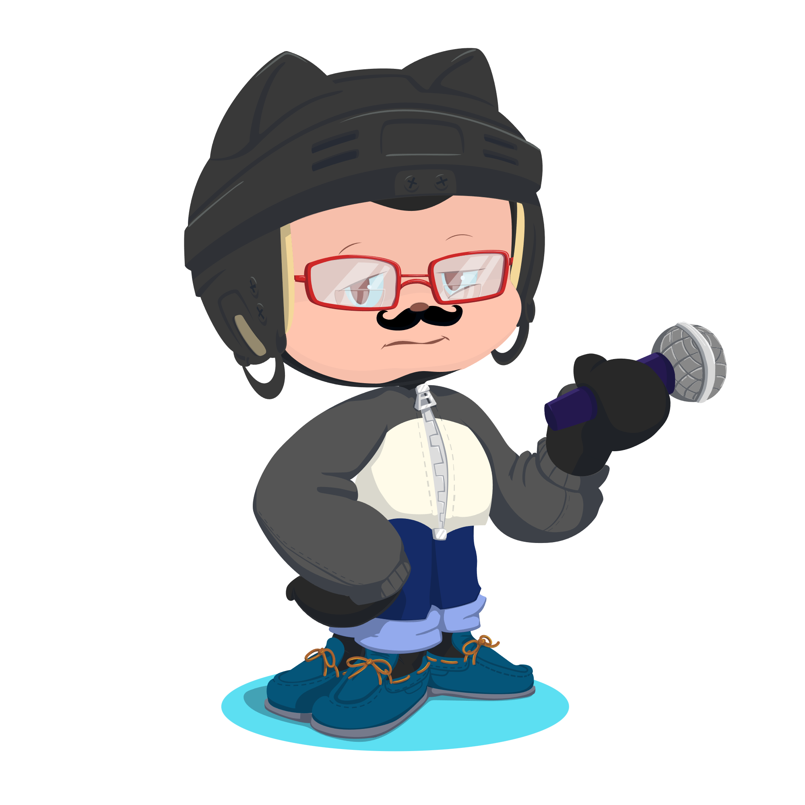
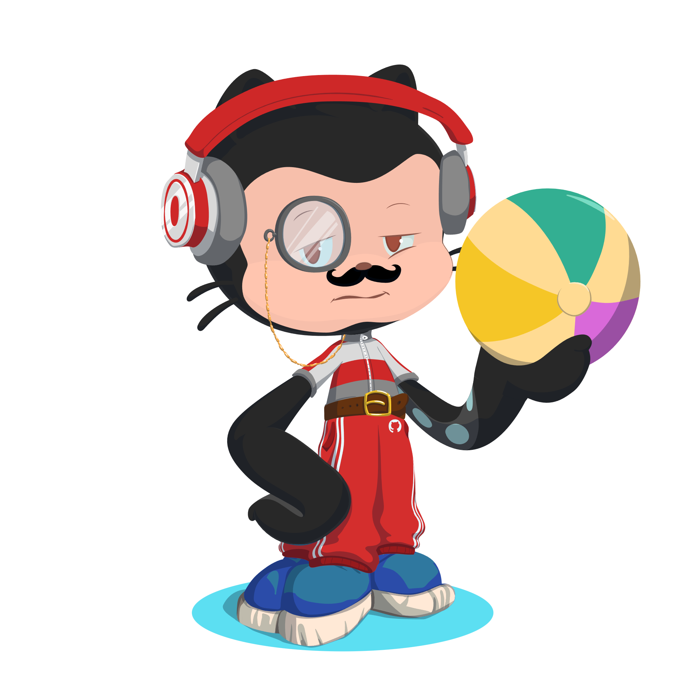
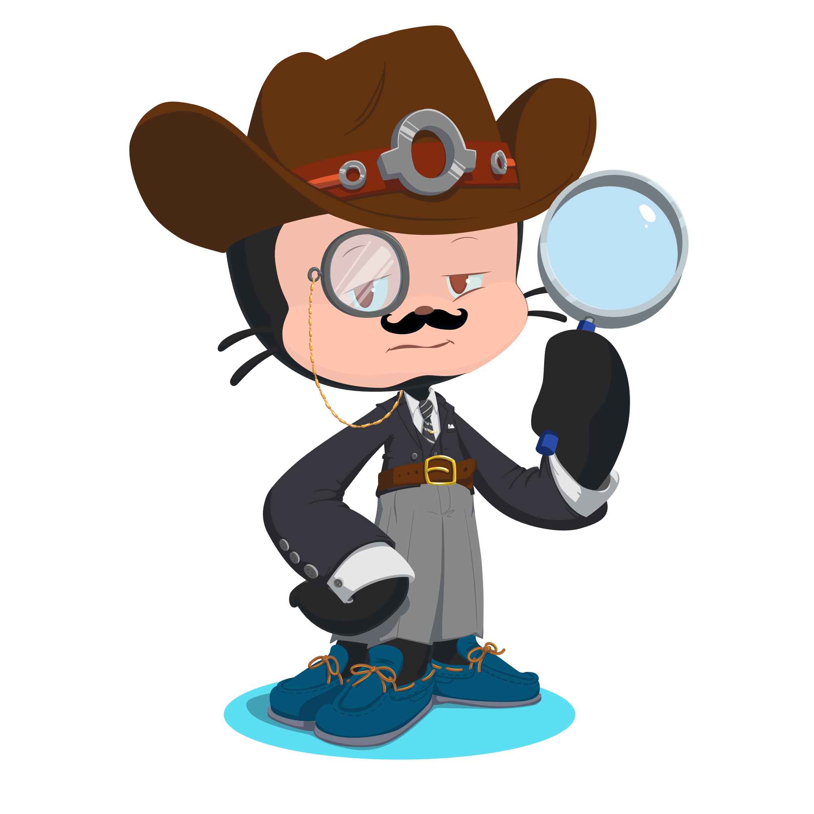
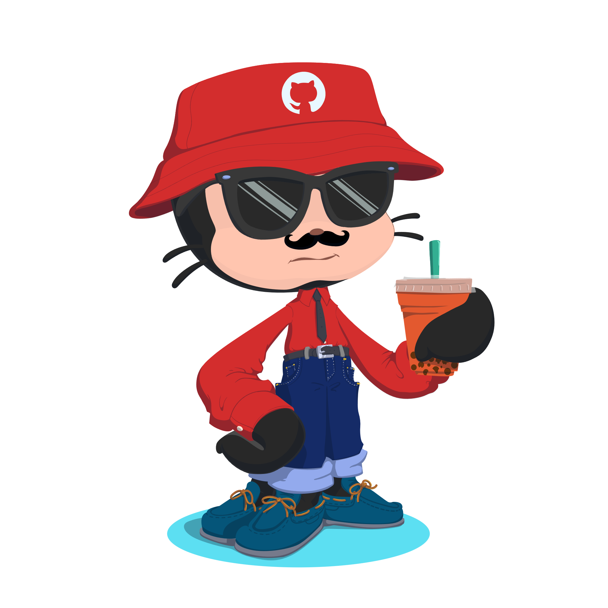

<!-- BANNER — white bg, black text, left aligned -->


<p>
  <a href="https://www.linkedin.com/in/ayushanand-choudhary">
    
  </a>
  &nbsp;
  <a href="mailto:ayushanandc@gmail.com">
    
  </a>
  &nbsp;
  
</p>

---



```yaml
name:               Ayushanand Choudhary
located_in:         Gurugram, India
job:                Backend Engineer @ Ginesys One
currently_building: MIRA — Multi-tenant AI Support Intelligence Platform
background:         2+ years shipping production-grade enterprise systems

past_experiences:
  - ["Backend Developer", "QA Engineer", "Ginesys One", "India", "2023-Now"]
  - ["Full-Stack Engineer", "Adcon Realty CRM", "NestJS + PostgreSQL", "2023"]
  - ["Backend Engineer", "College Admin System", "NestJS + REST APIs", "2022"]

fields_of_interest:
  - ["AI/RAG Pipelines", "LLM Orchestration", "Distributed Systems"]
  - ["Real-time Messaging", "Event-driven Architecture", "API Design"]

technical_background:
  - ["NestJS", "Kafka", "PostgreSQL", "Qdrant", "Redis", "Docker", "AWS"]
  - ["Groq", "Gemini", "LangChain", "WebSockets", "MongoDB", "Next.js"]

currently_learning: ["Advanced Kafka Patterns", "LLM Orchestration at Scale"]
open_to:            ["Backend", "SWE", "Full-Stack roles — open to relocate"]
philosophy:         "QA mindset in backend code — reliability is a feature, not a phase"
```

<br clear="right"/>

---

## ⚡ Recent Activity

<!--START_SECTION:activity-->
1. 🚀 Pushed commits to `MIRA` — AI Support Intelligence Platform
2. 🛠 Working on multi-tenant RAG pipeline with Qdrant + Kafka
3. 📦 Building `PG-Manager-Services` — multi-tenant SaaS for PG accommodation
<!--END_SECTION:activity-->

---

## 📊 Activity Graph




---

## 🧠 My GitHub Data



- 🗄 **`2+ years`** shipping production-grade enterprise systems
- 🤖 Currently building **MIRA** — RAG + Kafka + LLM orchestration
- 📬 Open to work — Backend · SWE · Full-Stack · Open to relocate
- 💬 Ask me about **NestJS, Kafka, RAG pipelines, System Design**
- 🌍 Based in Gurugram, India — open to relocate

<br clear="right"/>

---

## 🛠 Languages I've Mastered

<p>
  
  
  
  
  
  
  
  
  
  
  
  
  
</p>

---

## ⏱ This Week I Spent My Time On

<!--START_SECTION:waka-->
```text
TypeScript   █████████████░░░░░░░░   52.4%
JavaScript   ████░░░░░░░░░░░░░░░░░   16.2%
SQL          ███░░░░░░░░░░░░░░░░░░   12.1%
YAML         ██░░░░░░░░░░░░░░░░░░░    8.3%
Markdown     █░░░░░░░░░░░░░░░░░░░░    5.8%
Other        █░░░░░░░░░░░░░░░░░░░░    5.2%
```
<!--END_SECTION:waka-->

---

## 🐍 Contribution Snake

<picture>
  <source media="(prefers-color-scheme: dark)"  srcset="https://raw.githubusercontent.com/ayushanandchoudhary/ayushanandchoudhary/output/github-contribution-grid-snake-dark.svg"/>
  <source media="(prefers-color-scheme: light)" srcset="https://raw.githubusercontent.com/ayushanandchoudhary/ayushanandchoudhary/output/github-contribution-grid-snake.svg"/>
  
</picture>

---

<!-- FOOTER -->
<table width="100%">
<tr>
<td align="left" width="70%">

```
╔══════════════════════════════════════════╗
║  > hello world                           ║
║  > 2+ years of production systems        ║
║  > currently: building MIRA              ║
║  > status: open to work ✓                ║
║  > next: something big                   ║
╚══════════════════════════════════════════╝
```

</td>
<td align="right" width="30%">
  
</td>
</tr>
</table>
